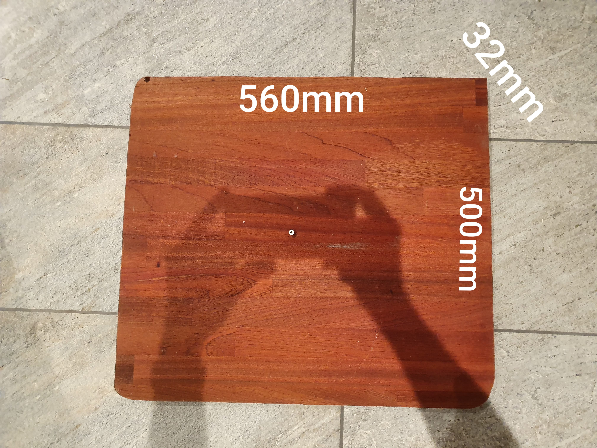

# SkjaereFjel
A 560x500x32mm slab of kitchen counter top were left over when the hole for the sink was cut. These are my project files for making a cutting board from that piece.

The stock is pretty flat, so I am hoping much planing won't be needed. Aiming for 30mm final thickness.

3D modeled cutting board:  
  
  
![Bottom view][reference/CuttingBoardBottomView.bmp]  

3D modeled parts.  
[Full project file](CuttingBoard.FCStd)  
[.obj of all parts including initial stock](CuttingBoard3DAllObjects.obj)  
[.obj of cutting board](CuttingBoard3D.obj)  
[.stl of cutting board](CuttingBoard3D.stl)  

2D vector files (.dxf)  
[Path to cut board out from stock](CuttingBoard2DOutCut.dxf)  
[Top of board operation](CuttingBoard2DTopOperation.dxf)  
[Bottom of board operation](CuttingBoard2DBottomOperation.dxf)  

I took an embarrassingly long time to make these files as I have no prior experience in 3D modeling or woodworking. I used FreeCAD to make the project and export in relevant formats, but I'm not sure if these files are adequate for a CNC project. Or if a CNC machine is even the way to most easily make this.